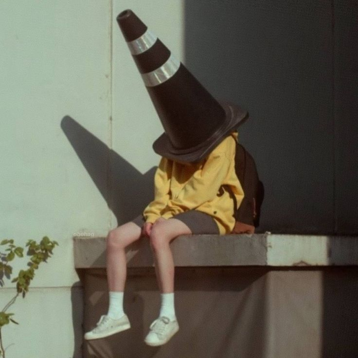

### Hi everybody ​👋

<!--
**yimei-wu/yimei-wu** is a ✨ _special_ ✨ repository because its `README.md` (this file) appears on your GitHub profile.

Here are some ideas to get you started:

- 🔭 I’m currently working on ...
- 🌱 I’m currently learning ...
- 👯 I’m looking to collaborate on ...
- 🤔 I’m looking for help with ...
- 💬 Ask me about ...
- 📫 How to reach me: ...
- 😄 Pronouns: ...
- ⚡ Fun fact: ...
-->

_This user is stressed out 24/7_

### About me 🌻

I'm a free-spirited girl, shy and reserved at first, but as you get to know me better, you'll discover a completely different side of me. I'm cheerful and friendly, with a hint of crazy side.
I have a myriad of passions, like reading books, writing, drawing and many more.

With so many passions, it's challenging to decide which one to pursue for my future career. As Confucius once said:

> _"Do what you love, abd you will never have to work a single day of your life"_

This has always been my philosophy because life is already hard and so why should we make it even harder?

In the end I chose the path of becoming a front-end developer and I'm currently at the outset of this journey, enrolled in studies at the **_Mohole Academy_** in Milan.
